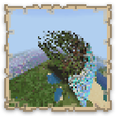

------

## Map Art Maker for Minecraft

**[https://gd-codes.github.io/mc-pixelart-maker/](https://gd-codes.github.io/mc-pixelart-maker/)**

------

A client-side web application that creates add-ons for the popular game Minecraft, to bring any image from your computer into the game!

### Using the App

The application is coded in the form of a static website, which is hosted publicly using Github Pages, at the URL above.

It is also a Progressive Web Application, so you can install a complete, functional offline copy of it (in compatible browsers) by clicking the '_Try Offline_' button on the website footer.

Alternatively, you can download a copy of the source code from here on Github, and build the static HTML files according to the directions in [Contributing Guidelines](.github/CONTRIBUTING.md). Then open the `index.html` file in your web browser (preferably with a local `http://` server and not directly as a `file://`).

### Previous Versions

The app is updated occasionally, to keep in sync with changes made to the latest version of the Minecraft Bedrock game. To use the app at an older version, you can clone the source code at these specific releases:

 Minecraft Version | App Code on Github |
| - | - |
| 1.17.0 "Caves & Cliffs Part 1" | [v3.1](https://github.com/gd-codes/mc-pixelart-maker/tree/v3.1) |
| 1.18.0 "Caves & Cliffs Part 2" | [v4.1](https://github.com/gd-codes/mc-pixelart-maker/tree/v4.1) |
| 1.19.0 "Wild Update" | [v4.3](https://github.com/gd-codes/mc-pixelart-maker/tree/v4.3) |

### Contributing

Bug reports, fixes and pull requests about the website are always welcome! Do also refer to the [closed issues and PRs](https://github.com/gd-codes/mc-pixelart-maker/issues?q=is%3Aclosed) to see previous discussion that took place. Open a new issue for suggestions and feedback.

Code contributions through Pull Requests are also appreciated! Please refer to the [Contributing Guidelines](.github/CONTRIBUTING.md) for an overview of the code.
